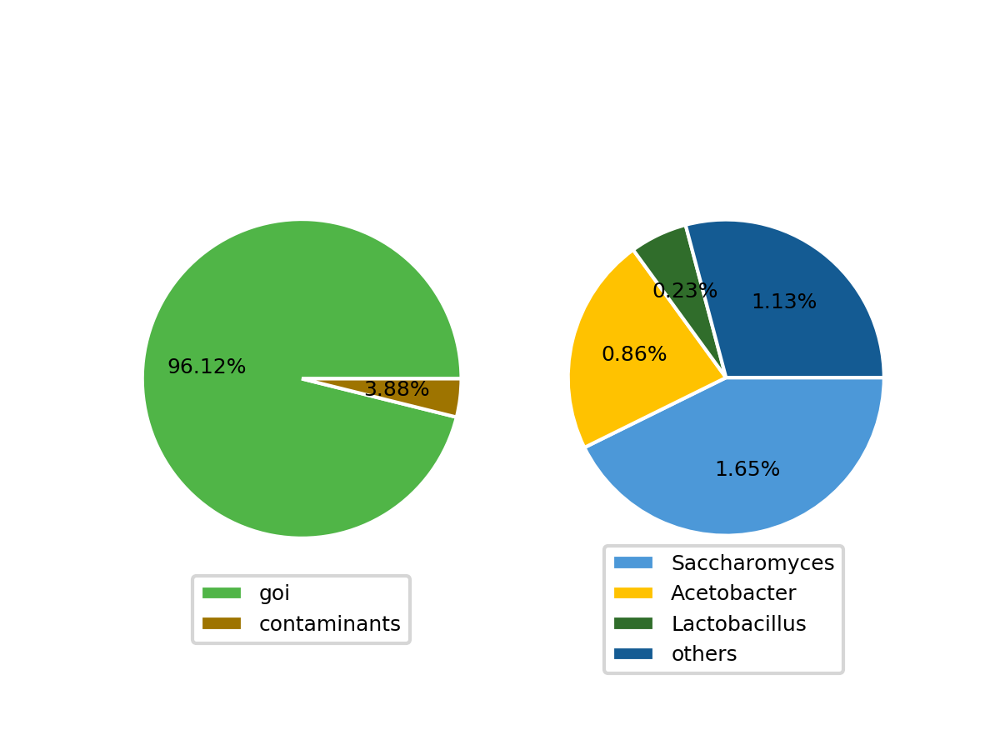
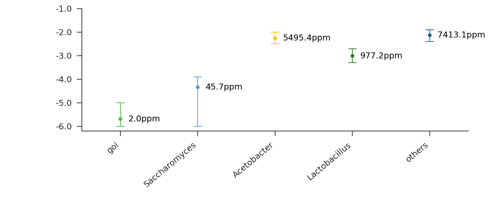
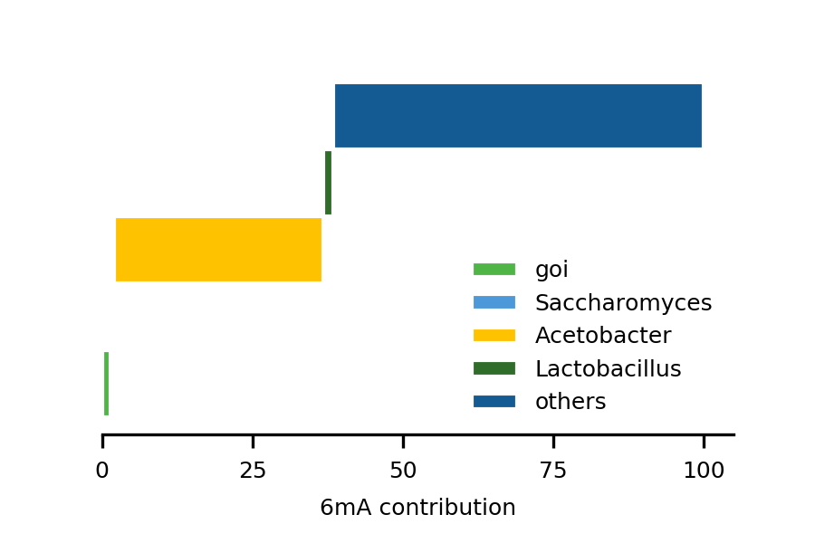

.. ::_tool-showcase

Tool showcase
==================

To showcase the toolbox applications, we provide examples for the analysis of the Drosophila ~45min embryo dataset presented in our manuscript (Fig 5). The dataset can be downloaded with the following commands from within a 6mASCOPE container: ``6mASCOPE get_test_data``.

Contamination estimation
------------------------

**Goal**

To get an idea about the overall contamination of a gDNA sample. This step helps users define the composition of a gDNA sample using a metagenomic approach to assign reads to different species.

**Description:**

For a given CCS dataset generated from short-insert library, 6mASCOPE will examine if there are contaminating species and calculate the proportion of reads mapped to the reference and top 50 contaminated species from reads that do not map to the eukaryotic species of interest.

**Inputs:**

#. CCS reads file capturing all the genetic material in a gDNA sample (.fasta, pre-computed in the following example)
#. Eukaryotic reference of genome of interest (.fasta)

**Outputs:**

For a given CCS dataset generated from short-insert library, ``6mASCOPE`` will examine if there are contaminating species and  calculate the proportion of reads mapped to the reference and top 50 contaminated species from reads that do not map to the eukaryotic species of interest.

.. code-block:: none

	Remove 8491 possible inter-species chimeric reads for further analysis
	#total_CCS	mapped_to_goi	contaminants
	666159	640345 (96.1249%)	25814 (3.87505%)

	Top 50 mapped species outside goi reference
	#Count	Species
	  10836 Saccharomyces cerevisiae
	   2413 Acetobacter tropicalis
	   1524 Acetobacter pasteurianus
	   1479 Lactobacillus plantarum
	    882 Acetobacter sp.
	...

(Full species list can be viewed in ``test.contam.estimate.txt``).

**Example commands:**

.. code-block:: none

        6mASCOPE contam -c test.ccs.fasta -r test.ref.fasta -o test.contam.estimate.txt

In this example, ``test.ccs.fasta`` includes CCS reads (674,650) from the Drosophila ~45min embryo reads dataset described in our manuscript and pre-filtered with command ``6mASCOPE ccs``. Using 5 cores, runtime is ~12m51s. The output shows ~3.9% CCS reads come from contaminated sources other than Drosophila melanogaster, the genome of interest. Please be noted, blastn is embedded within this step, which will need at least 32-64G RAM.

6mA analysis using quantitative deconvolution
---------------------------------------------

**Goal**

For each source determined in ``6mASCOPE contam``, this step will quantify the 6mA/A level and calculate the 6mA contribution (%) of each source to the total 6mA abundance in the gDNA sample.

**Inputs:**

#.	The same CCS reads file as explained above for Contamination Estimation  (.fasta).
#.	IPD and QV information of the CCS reads (pre-computed in the following example, ; this can be generated for new data with ``6mASCOPE ipd`` command, as explained in detailed tutorial).
#.	User defined groups besides the genome of interest. Examples as shown below. (Left columns: subgroup name. Right columns: contamination sources, use vertical line if multiple sources included within one subgroup).

.. code-block:: none

	Saccharomyces	Saccharomyces
	Acetobacter	Acetobacter|Komagataeibacter
	Lactobacillus	Lactobacillus

**Outputs:**

A table including the following information: the proportion (%) of reads from each source out of the total number of reads; source-specific 6mA/A level with 95% confidence intervals (log10-transformed), and contribution (%) of each source to the total 6mA abundance in the gDNA sample (as presented in the manuscript Figure 5A, B, C)

**Example commands:**

.. code-block:: none

        6mASCOPE quant -c test.ccs.fasta -i test.IPD.out.A -o test -r test.ref.fasta -s subgroup.txt

In this example, the file test.IPD.out.A includes the pre-calculated IPD and QV information on the CCS molecules (can be generated with ``6mASCOPE ipd``). Only Adenines were included here to to reduce computational time and ease evaluation. ``subgroup.txt`` include the pre-defined main contamination groups, inferred from the top mapped species and blast output from ``6mASCOPE contam``. Using 5 cores, runtime is ~13m17s.

**Example outputs:**

.. code-block:: none

	     #Subgroup   count  ReadsProportion  6mAlevel(ppm)  6mAlevel(log10)  UpCI  DownCI  subtotal(ppm)  contribution(%)
	           goi  640345           0.9612         2.0417            -5.69  -5.0    -6.0         1.9625           1.4431
	 Saccharomyces   11022           0.0165        45.7088            -4.34  -3.9    -6.0         0.7542           0.5546
	   Acetobacter    5757           0.0086      5495.4087            -2.26  -2.0    -2.5        47.2605          34.7522
	 Lactobacillus    1517           0.0023       977.2372            -3.01  -2.7    -3.3         2.2476           1.6528
	        others    7518           0.0113      7413.1024            -2.13  -1.9    -2.4        83.7681          61.5974

1. **The % of total CCS reads mapped to different subgroups.** Left: The % of CCS reads mapped to *D. melanogaster* (genome of interest) and contaminant subgroups. Right: The % of CCS reads mapped to different contaminant sources.

2. **6mA quantification and 95% confidence intervals (log10-transformed) on CCS reads mapped to different subgroups.**

.. note::

	Please be noted, it is important to combine the estimated 6mA/A level by ``6mASCOPE`` with its confidence interval for reliable data interpretation. In this example, the 6mA/A level of Saccharomyces (45.7ppm) does not mean abundant 6mA events in this subgroup because it has a wide range of confidence interval (1-125ppm; -6.0 to -3.9 with log10 transformed). In the paper, an additional Sequel II run for this single species (higher yield) actually shows extremely low 6mA level (2ppm, confidence interval: 1-10ppm).

	

3. **Contribution (%) of each source to total 6mA abundance in the gDNA sample.** CCS reads mapped to the *D. melanogaster* genome only explains 1.4% of the total 6mA events in the gDNA sample (green). 

These figures can be drawn with ``sh ~/code/draw_example.sh test.6mASCOPE.txt``.

